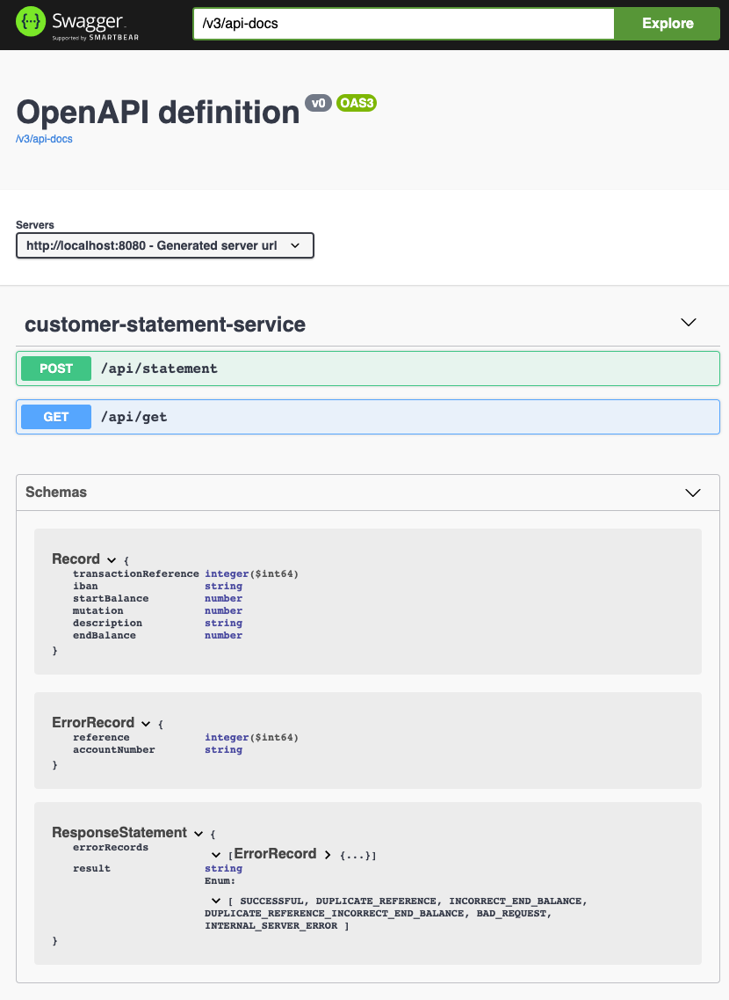

# CustomerStatement

My one-hour solution  
Most of that hour went into writing tests

## Build

```shell
mvnw clean package
```

## Run

```shell
mvnw spring-boot:run
```

or

```shell
mvnw clean package
java -jar target/CustomerStatement.jar
```

## Requests



* Goto [OpenApi endpoint](http://localhost:8080/openapi.html)
* or look at the `Requests.http` file for request examples

